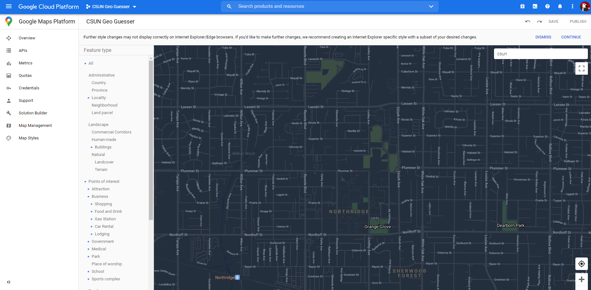
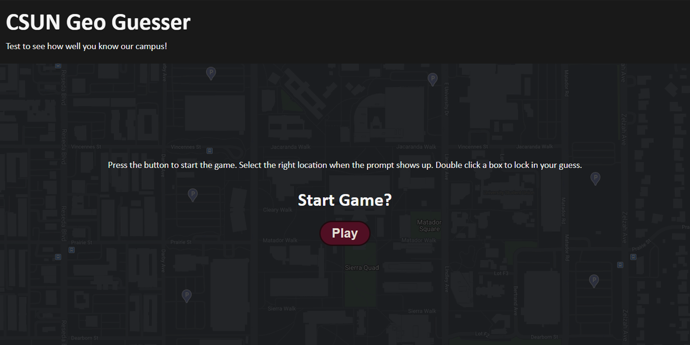

# GeoGuesser Inspired Game using the Google Maps API

**Published:** *12/04/2020*

This week I got to work with the **Google Maps API** to build a *CSUN geo-guesser* using vanilla HTML, CSS, & JS. I also learned a new CI tool called **GitHub Actions** which is build directly into **GitHub** (the repository I'm hosting from).

---

## Google Maps API Overview
During my inital project development for the *Gue-Guesser* type project, I had to work with the **Google Maps API** to deliver a custom generated map based on the *CSUN* location. The set-up process was a little weird where at first I had to generate a new `API key` that you must create in your **Google Cloud Service** account. Each *key* is based off the *Project* associated. One thing to note is to **lockdown any key** created for security purposes so no one other than the intended purpose of the key is mis-used. In my case I had to enable the **Google Maps Service** through the top search bar so I was able to restrict the key to be only used in the *Google Maps API* for my specified website.

## Customizing my Google Map
After *authorizing* my account, I simply had to attach my `API key` in the script import for google maps referenced on this page https://developers.google.com/maps/documentation/javascript/overview. Inside the link, a **callback** query in the url is used to call a new function called `initMap()` which is used as the entry point for google maps to use after the script has loaded. Inside this function I used a method provided by google to generate a new map based of the parameters I passed into it called `new google.maps.Map`. I also took the time to generate a customized map and attached an `id` so it would display a custom map with no names to buildings, since I was making a geo-guesser type game.

## Creating my CSUN Geo-Guesser Game
Once I had the inital set-up for the map, I had to create the functionality to make the guessing game. I used a new method provided by google maps to generate *shapes* to be used to give the user a place to click and check to see if their guess was correct. This method name was referenced as `new google.maps.Rectangle` and can be found at the following link https://developers.google.com/maps/documentation/javascript/shapes. Once I had a new method to use to generate shapes, the *API* also provides a **listener** function to be called when this specific shape instance is called which is `addListener('event', function call)`. These key *API* features allowed me build out all the required features for my geo-guesser game.

 

Feel free to check out my **CSUN Geo Guesser** repository at: https://github.com/BrianLinggadjaja/csun_geo-guesser

## Using GitHub Actions for Repo Automation
My first impresions of **GitHub Actions** were great! It was a step in the right direction compared to **Travis-CI** (another well known automation tool) but in this case it was built directly into **GitHub** (the most popular repo hosting platform). The toolset was just as well verse if not more and the community of open source `Actions` are abundant with most use cases solved with maybe a few changes to the action file. To initalize your actions inside a repository you have to create a folder called `.github` in which all your actions are hosted inside via `.yml` files. In my case I used github actions to target my `main` branch where any pushes made will run a `linting/pretification` job where it will automatically fix any issues if a developer forgot to do so on their end. In total, I will definetly be moving forward with more **GitHub Actions** instead of *Travis-CI* since their service *availability* has been going down recently.

All jobs that are ran have a status completion tab inside your **Actions** tab inside your repo where you can see what steps the action took in resolving the job.

Check out more about GitHub Actions at the following link: https://docs.github.com/en/free-pro-team@latest/actions/learn-github-actions/introduction-to-github-actions
