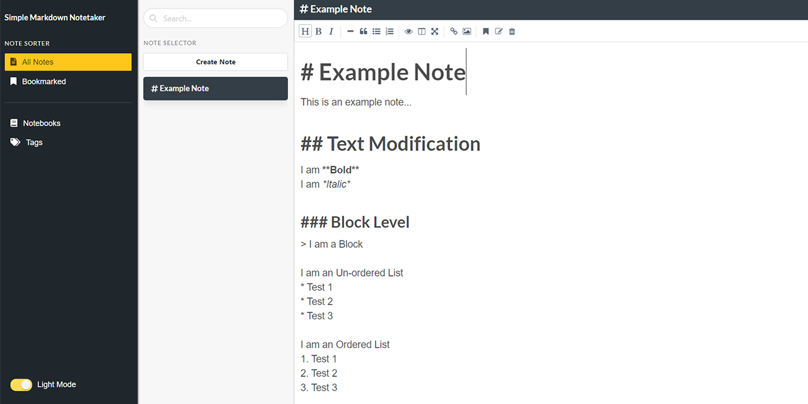
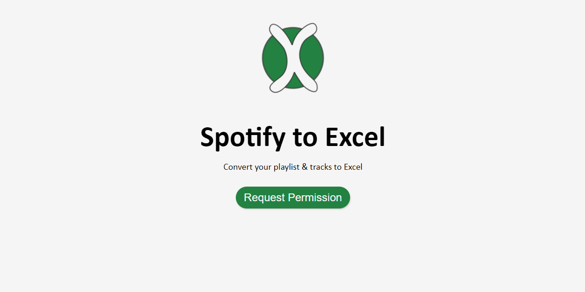
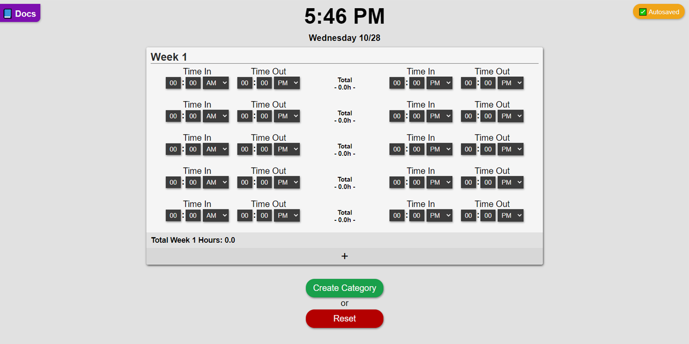
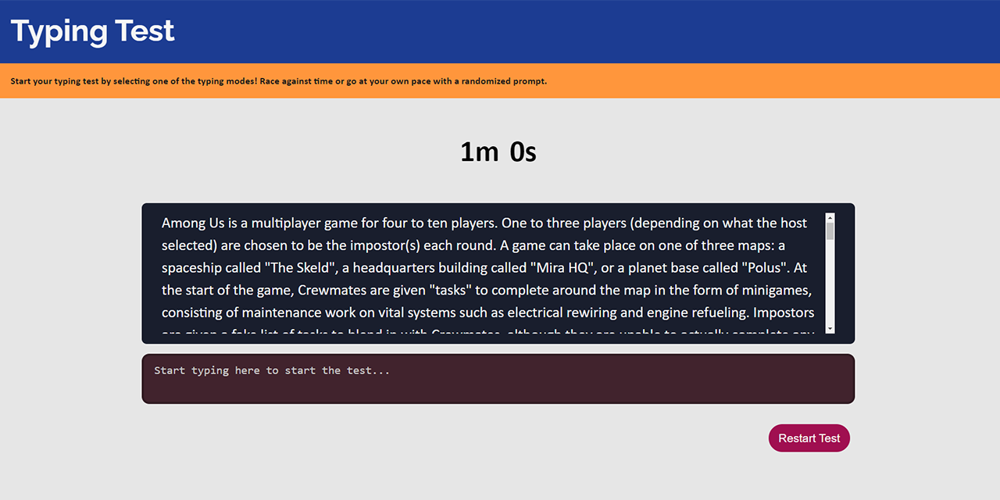

# Personal Projects
 

## Simple Markdown Notetaker <Badge text="active development" type="warning"/>
**Simple Markdown Notetaker**, a simple WebApp using external libraries w/ Vue.js to help build a Markdown editor/preview experience.

[Visit Repo](https://github.com/BrianLinggadjaja/simple_markdown_notetaker)
|
[Visit Demo Page](https://brianlinggadjaja.github.io/simple_markdown_notetaker/)

## Spotify To Excel <Badge text="active development" type="warning"/>
**Spotify to Excel**, a conversion tool to help grab your Spotify playlist and convert it into a `.xlsx` file using vanilla JS.

[Visit Repo](https://github.com/BrianLinggadjaja/spotify_to_excel-v2)
|
[Visit Demo Page](https://brianlinggadjaja.github.io/spotify_to_excel-v2)

## Timesheet <Badge text="completed" type="tip"/>
**Timesheet**, a tabular timesheet calculator built with vanilla JS.

[Visit Repo](https://github.com/BrianLinggadjaja/timesheet)
|
[Visit Demo Page](https://brianlinggadjaja.github.io/timesheet/)

## Typing Test <Badge text="completed" type="tip"/>
**Typing Test**, a dual mode typing test built with vanilla JS.

[Visit Repo](https://github.com/BrianLinggadjaja/typing_test)
|
[Visit Demo Page](https://brianlinggadjaja.github.io/typing_test/)

